# motor-graph-generation gallery — v0.1

_Auto-generated by `scripts/build_catalogue.py`. 25 chart styles + 8 recipes._

**Don't edit this file by hand** — change the underlying docstrings then re-run `poetry run python scripts/build_catalogue.py`.

## Chart styles

Plotly chart-style primitives. Each takes a tidy `pandas.DataFrame` and returns a `plotly.graph_objects.Figure`. Source: `motor_graphs.styles`.

### `grouped_bars_by_grade_two_series`

Grouped vertical bars by risk grade with two side-by-side series.

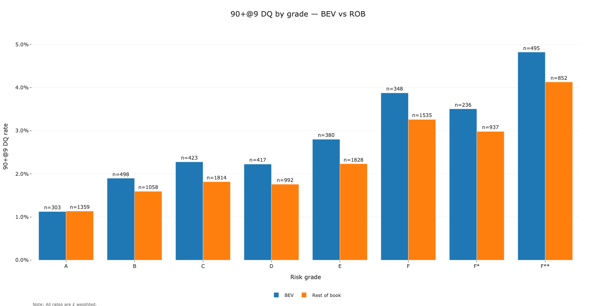

**Use this when:**

- You want to compare a rate (DQ, FPD, VT, etc.) across risk grades for
two segments side by side: BEV vs ROB, Carrera vs Torino, dealer vs
non-dealer.

**Data shape:**

```
Long/tidy DataFrame, one row per (grade, series):
grade   (str)   — risk grade label (A, B, ..., F**)
series  (str)   — exactly 2 distinct values (the two segments)
rate    (float) — value to plot
n       (int, opt) — sample size; required if annotate_n=True
```

**Signature:** `grouped_bars_by_grade_two_series(df, *, grade="grade", series="series", y="rate", n="n", series_order=None, series_colors=None, title=None, xlabel="Risk grade", ylabel="Rate", y_tickformat=".1%", annotate_n=True, small_sample_handling="show") -> go.Figure`

_Module:_ `motor_graphs.styles.bars`

---

### `stacked_bar_100pct_monthly_2x2`

100%-stacked monthly bars showing category mix over time, optionally faceted 2×2.

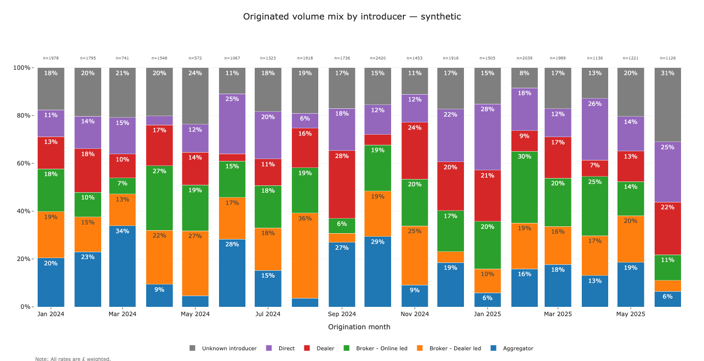

**Use this when:**

- You want to track composition (introducer mix, fuel-type mix, LTV-band
  mix, age-band mix) over monthly cohorts.
- You want to spot regime shifts in volume composition.

**Data shape:**

```
Long/tidy DataFrame:
month     (str or date) — origination month label
category  (str)         — the stacked-band category
share     (float)       — share in 0-100 (already a percentage, NOT decimal)
n         (int, opt)    — total sample size at that month (required if annotate_n=True)
facet     (str, opt)    — if given, the chart is laid out 2×2 with one
                           panel per distinct facet value (exactly 4 expected)
```

**Signature:** `stacked_bar_100pct_monthly_2x2(df, *, month="month", category="category", share="share", n="n", facet=None, category_colors=None, title=None, xlabel="Origination month", annotate_n=True) -> go.Figure`

_Module:_ `motor_graphs.styles.bars`

---

### `bar_horizontal_top_n`

Single horizontal bar chart, sorted descending, showing top-N categories.

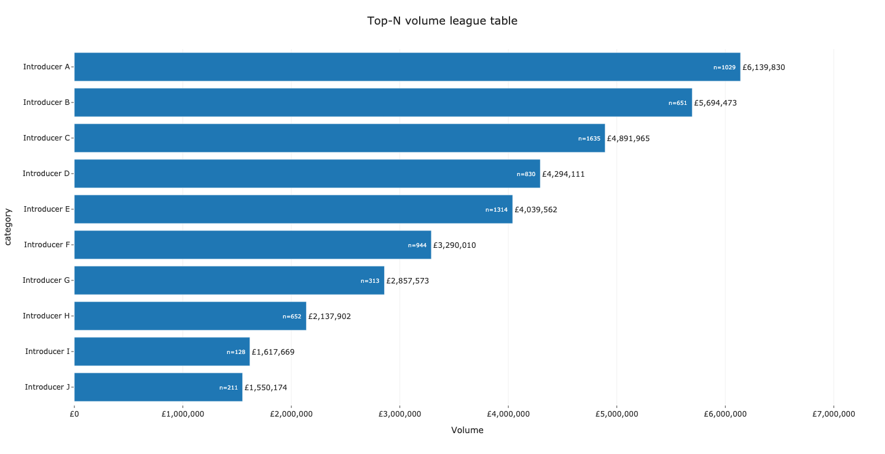

**Use this when:**

- You want a league-table view of top introducers / dealers / brokers
by £ originated (or any other count/volume metric).

**Data shape:**

```
Long/tidy DataFrame, one row per category:
category  (str)   — bar label
value     (float) — magnitude (£ or count)
n         (int, opt) — sample size; required if annotate_n=True
```

**Signature:** `bar_horizontal_top_n(df, *, category="category", value="value", n="n", top_n=10, value_fmt="£,.0f", title=None, xlabel="Volume", ylabel=None, annotate_n=True, small_sample_handling="show") -> go.Figure`

_Module:_ `motor_graphs.styles.more_bars`

---

### `bar_plus_line_share_top_n`

Vertical bar (amount share) + overlaid line (count share) on top-N categories.

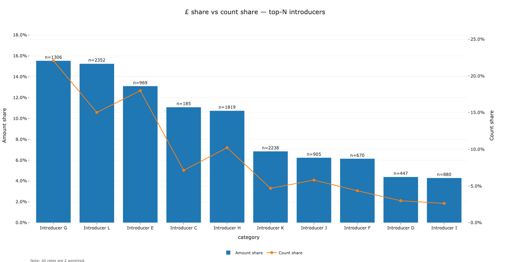

**Use this when:**

- You want to compare £-share against count-share across the same
ranked set of categories — useful for spotting introducers that
punch above their weight in £ vs volume.

**Data shape:**

```
Long/tidy DataFrame, one row per category:
category      (str)   — bar/line x-axis label
amount_share  (float) — bar value (decimal, e.g. 0.18 for 18%)
count_share   (float) — overlaid-line value (decimal)
n             (int, opt) — sample size; required if annotate_n=True
```

**Signature:** `bar_plus_line_share_top_n(df, *, category="category", bar_value="amount_share", line_value="count_share", n="n", top_n=10, title=None, xlabel=None, bar_ylabel="Amount share", line_ylabel="Count share", y_tickformat=".1%", annotate_n=True, small_sample_handling="show") -> go.Figure`

_Module:_ `motor_graphs.styles.more_bars`

---

### `stacked_bar_volume_2x2_with_rate_line`

2×2 panel: three stacked-bar volume panels by introducer + one rate-line panel.

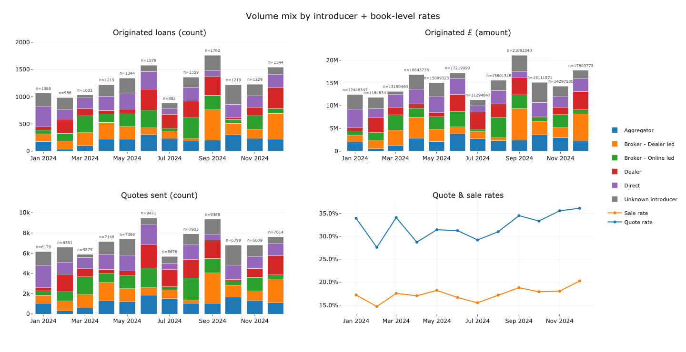

**Use this when:**

- You want a single "KPI dashboard" snapshot of origination volume,
loaned £, quoted volume, and the book-level quote/sale rates side
by side in one figure.

**Data shape:**

```
Long/tidy DataFrame, one row per (month, introducer):
month          (str or date) — origination month label
introducer     (str)         — introducer category (mapped via
                               INTRODUCER_CATEGORY_COLORS)
count          (int)         — loans originated this row
amount         (float)       — £ originated this row
quoted_count   (int)         — quotes sent this row
quote_rate     (float)       — book-level quote rate for the month
                               (decimal, same on every row of a month)
sale_rate      (float)       — book-level sale rate for the month
                               (decimal, same on every row of a month)
```

**Signature:** `stacked_bar_volume_2x2_with_rate_line(df, *, month="month", introducer="introducer", count_col="count", amount_col="amount", quoted_col="quoted_count", quote_rate_col="quote_rate", sale_rate_col="sale_rate", title=None, annotate_n=True) -> go.Figure`

_Module:_ `motor_graphs.styles.more_bars`

---

### `waterfall_components_by_grade`

1×N panel grid of grouped bars over cashflow components, one panel per grade group.

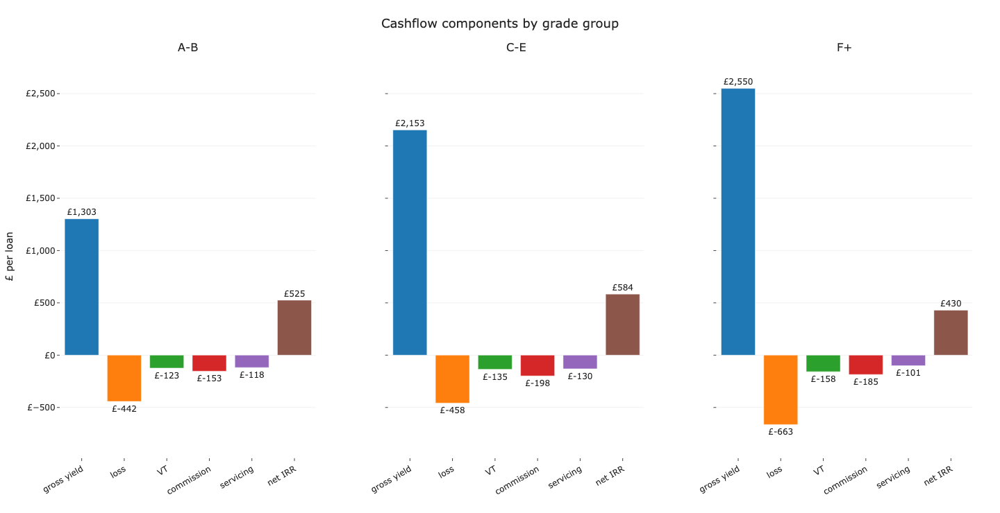

**Use this when:**

- You want a snapshot of the per-loan cashflow buildup (gross yield →
loss → VT → commission → servicing → net IRR) broken out by grade
group (A-B / C-E / F+) in a single comparable figure.

**Data shape:**

```
Long/tidy DataFrame, one row per (grade_group, component):
grade_group  (str)   — panel split (e.g. "A-B", "C-E", "F+")
component    (str)   — bar label within each panel; preserves
                        first-appearance order across panels
value        (float) — height of the bar
```

**Signature:** `waterfall_components_by_grade(df, *, grade_group="grade_group", component="component", value="value", title=None, ylabel="£ per loan", y_tickformat="£,.0f", annotate_n=False) -> go.Figure`

_Module:_ `motor_graphs.styles.more_bars`

---

### `heatmap_swap`

X-grade × Y-grade swap matrix heatmap with count + £-pct annotations.

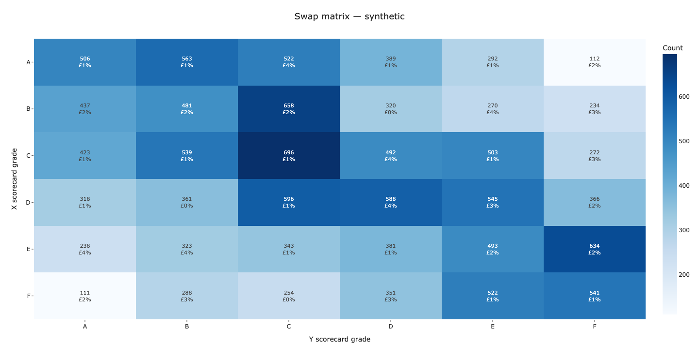

**Use this when:**

- You have a pivot of two scorecards (X vs Y) and want to see how loans
shift between grade buckets — the "swap matrix" that drives MoTa
scorecard rollout decisions.

**Data shape:**

```
Long/tidy DataFrame, one row per cell:
x_grade       (str)   — grade under scorecard X (rows)
y_grade       (str)   — grade under scorecard Y (cols)
count         (int)   — number of loans in this cell
pct_amount    (float, opt) — £-share in 0-100; shown alongside count if present
```

**Signature:** `heatmap_swap(df, *, x_grade="x_grade", y_grade="y_grade", count="count", amount_share="pct_amount", title=None, x_label="Y scorecard grade", y_label="X scorecard grade", colorscale="Blues", annotate=True) -> go.Figure`

_Module:_ `motor_graphs.styles.heatmaps`

---

### `cohort_lines_vs_mob`

One coloured line per cohort vs MOB, with optional dashed expected overlay.

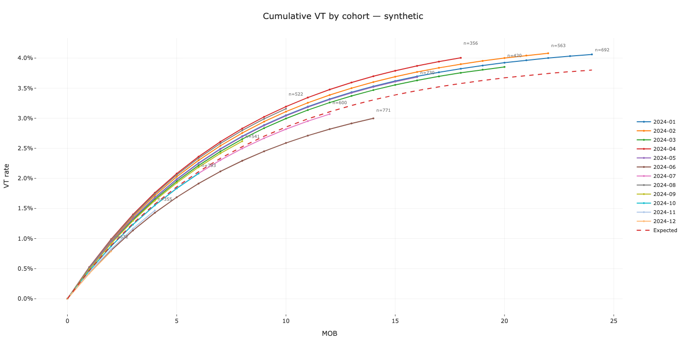

**Use this when:**

- You want to track a cumulative rate (VT, prepayment, gross default)
  for each cohort separately, against months-on-book.
- You want to spot whether more recent cohorts are diverging from older
  ones, and from a benchmark curve.

**Data shape:**

```
Long/tidy DataFrame, one row per (cohort, mob):
cohort    (str or date) — cohort label (e.g. "2024-01", "2024-Q2")
mob       (int)         — months on book, integer
rate      (float)       — cumulative rate at that MOB (decimal)
expected  (float, opt)  — single expected curve; same value across cohorts
                           at a given MOB. Pass expected=None to disable.
n         (int,   opt)  — cohort size; required if annotate_n=True.
                           Same value across MOBs for a given cohort.
```

**Signature:** `cohort_lines_vs_mob(df, *, cohort="cohort", mob="mob", y="rate", expected="expected", n="n", title=None, xlabel="MOB", ylabel="Rate", y_tickformat=".1%", annotate_n=True, small_sample_handling="show") -> go.Figure`

_Module:_ `motor_graphs.styles.lines`

---

### `dq_2x2_actual_vs_expected`

2×2 grid of line subplots — actual vs expected rate per DQ metric.

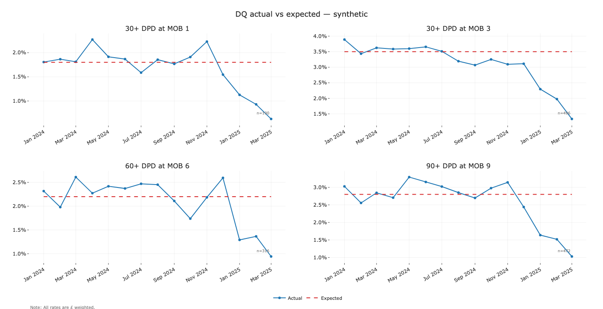

**Use this when:**

- You have rate-over-cohort data for exactly 4 DQ metrics (30+/60+/90+
  at various MOBs) and want to compare actual vs benchmark per metric.
- You want a quick visual scan of divergence between blue solid (actual)
  and red dashed (expected) across multiple horizons in one figure.

**Data shape:**

```
Long/tidy DataFrame, one row per (cohort, metric):
cohort   (str or date) — the cohort label (e.g. "2024-01", "2024-Q2")
metric   (str)         — exactly 4 distinct values, one per subplot
actual   (float)       — actual rate (decimal, e.g. 0.018 for 1.8%)
expected (float)       — expected/benchmark rate
n        (int, opt)    — sample size; required if annotate_n=True
```

**Signature:** `dq_2x2_actual_vs_expected(df, *, cohort="cohort", metric="metric", actual="actual", expected="expected", n="n", title=None, annotate_n=True, small_sample_handling="show") -> go.Figure`

_Module:_ `motor_graphs.styles.lines`

---

### `dq_2x2_with_n_annotated`

2×2 grid of actual-vs-expected lines with n= annotated on EVERY visible point.

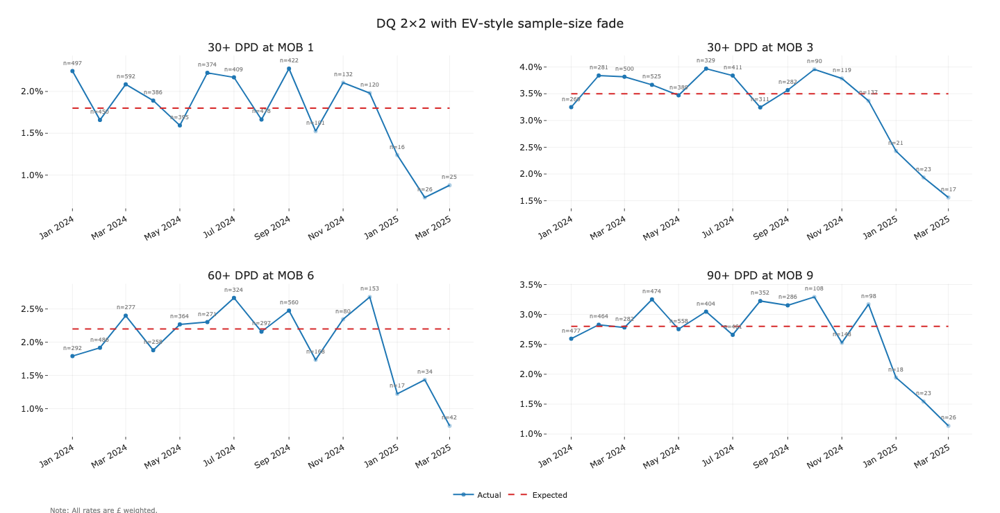

**Use this when:**

- You have rate-over-cohort data for exactly 4 DQ metrics and want a
  per-point readout of sample size, not just the most recent one.
- You want fading on small-n points by default so the eye discounts
  them visually — useful for the very recent / immature MOBs.

**Data shape:**

```
Long/tidy DataFrame, one row per (cohort, metric):
cohort   (str or date) — cohort label
metric   (str)         — exactly 4 distinct values, one per subplot
actual   (float)       — actual rate (decimal)
expected (float)       — expected/benchmark rate
n        (int)         — sample size; required when annotate_n=True.
                         Some n<50 / 50≤n<200 / n≥200 spreads exercise
                         the small-sample fade/suppress logic.
```

**Signature:** `dq_2x2_with_n_annotated(df, *, cohort="cohort", metric="metric", actual="actual", expected="expected", n="n", title=None, annotate_n=True, small_sample_handling="fade") -> go.Figure`

_Module:_ `motor_graphs.styles.dq_subplots`

---

### `regression_validation_1x3`

1×3 subplot grid — actual vs predicted per regression-validation metric.

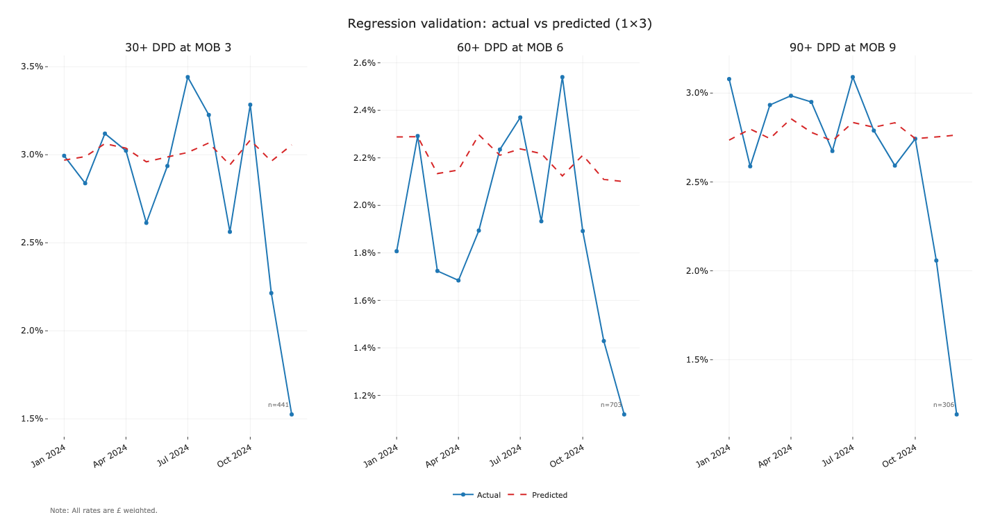

**Use this when:**

- You have a regression / forecasting model and want to compare
  realised vs predicted values across exactly 3 validation metrics
  (e.g. 30+@3, 60+@6, 90+@9) side-by-side.
- The actual/predicted contrast is the focus and a single row makes
  it easy to scan left-to-right.

**Data shape:**

```
Long/tidy DataFrame, one row per (cohort, metric):
cohort    (str or date) — cohort label, sorted within each panel
metric    (str)         — exactly 3 distinct values, one per panel
                           (panels appear in alphabetical metric order)
actual    (float)       — realised value (decimal)
predicted (float)       — model prediction (decimal)
n         (int, opt)    — sample size; required if annotate_n=True
```

**Signature:** `regression_validation_1x3(df, *, cohort="cohort", metric="metric", actual="actual", predicted="predicted", n="n", title=None, annotate_n=True, small_sample_handling="show") -> go.Figure`

_Module:_ `motor_graphs.styles.dq_subplots`

---

### `cohort_lines_1x3_by_grade_group`

1×3 cohort-line subplots, one panel per grade group.

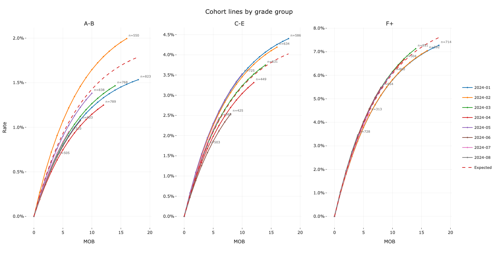

**Use this when:**

- You want to compare cumulative rate (VT, default, prepayment) by
  cohort within each of the 3 grade buckets (typically "A-B", "C-E",
  "F+") — keeping each grade group on its own y-scale via separate
  panels.
- You want a single Expected curve overlaid per panel (red dashed),
  shared across cohorts in that panel.

**Data shape:**

```
Long/tidy DataFrame, one row per (cohort, mob, grade_group):
cohort      (str or date) — cohort label
mob         (int)         — months on book
grade_group (str)         — exactly 3 distinct values, one per panel
                             (panels appear in alphabetical group order)
rate        (float)       — cumulative rate at that MOB (decimal)
expected    (float, opt)  — single expected curve per (grade_group, mob).
                             Pass expected=None (or omit column) to
                             disable the benchmark overlay.
n           (int, opt)    — cohort size; required if annotate_n=True.
                             Same value across MOBs for a given cohort.
```

**Signature:** `cohort_lines_1x3_by_grade_group(df, *, cohort="cohort", mob="mob", grade_group="grade_group", y="rate", expected="expected", n="n", title=None, ylabel="Rate", y_tickformat=".1%", annotate_n=True, small_sample_handling="show") -> go.Figure`

_Module:_ `motor_graphs.styles.dq_subplots`

---

### `cohort_lines_1x3_paired_expected`

1×3 cohort lines — per-cohort actual SOLID + per-cohort expected DASHED, same colour.

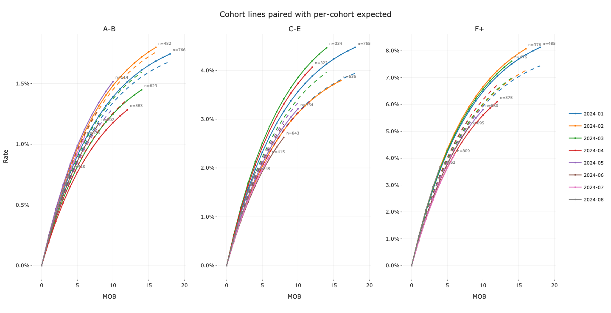

**Use this when:**

- Each cohort has its OWN expected curve (a per-cohort forecast) and you
  want to spot cohort-level drift from cohort-level expectations.
- Pairing actual/expected in the same colour per cohort makes the
  divergence within a cohort visually obvious — the dashed line drifts
  away from the solid line of the same colour.

**Data shape:**

```
Long/tidy DataFrame, one row per (cohort, mob, grade_group):
cohort      (str or date) — cohort label
mob         (int)         — months on book
grade_group (str)         — exactly 3 distinct values, one per panel
actual      (float)       — realised cumulative rate (decimal)
expected    (float)       — PER-COHORT expected curve (decimal)
n           (int, opt)    — cohort size; required if annotate_n=True
```

**Signature:** `cohort_lines_1x3_paired_expected(df, *, cohort="cohort", mob="mob", grade_group="grade_group", actual="actual", expected="expected", n="n", title=None, ylabel="Rate", y_tickformat=".1%", annotate_n=True, small_sample_handling="show") -> go.Figure`

_Module:_ `motor_graphs.styles.dq_subplots`

---

### `roll_rate_dual_axis_lines`

Single-panel dual-y-axis line chart for roll rates at different scales.

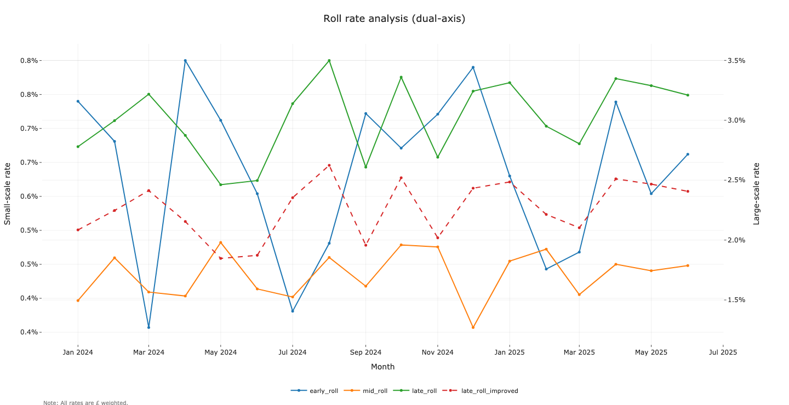

**Use this when:**

- You have multiple roll-rate series that live at different orders of
  magnitude (e.g. early-stage roll ~0.5% on one axis vs late-stage roll
  ~3% on another) and want them on the same x-axis (monthly).
- You also want to overlay "counterfactual" / improvement dashed lines.

**Data shape:**

```
Wide DataFrame, one row per period:
x                (str/date) — month label
small_axis_cols  (float)    — series for the LEFT y-axis (low scale)
large_axis_cols  (float)    — series for the RIGHT y-axis (higher scale)
n                (int, opt) — total volume for the month (not normally
                               annotated — annotate_n defaults to False
                               because the chart is about RATES).
```

**Signature:** `roll_rate_dual_axis_lines(df, *, x="month", small_axis_cols=('s1',), large_axis_cols=('s2', 's3', 's4'), dashed_cols=(), title=None, xlabel="Month", small_ylabel="Small-scale rate", large_ylabel="Large-scale rate", y_tickformat=".1%", n=None, annotate_n=False) -> go.Figure`

_Module:_ `motor_graphs.styles.dq_subplots`

---

### `lines_1x2_funnel_by_introducer`

1×2 line subplots — one line per introducer in each panel.

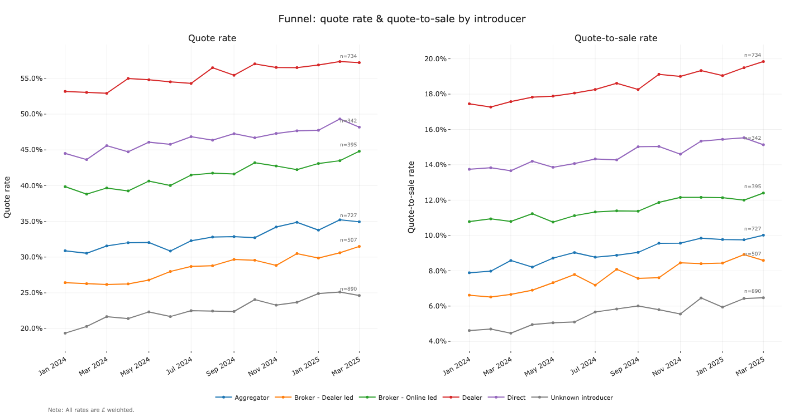

**Use this when:**

- You want to compare two conversion-funnel rates (e.g. quote rate and
  quote-to-sale rate) across introducer categories over time.
- You need a side-by-side view so movement in the upstream funnel stage
  can be visually tied to movement in the downstream stage.

**Data shape:**

```
Long/tidy DataFrame, one row per (month, introducer):
month       (str or date) — origination month label
introducer  (str)         — introducer category (matches keys of
                              INTRODUCER_CATEGORY_COLORS where possible)
quote_rate  (float)       — left-panel rate (decimal)
sale_rate   (float)       — right-panel rate (decimal)
n           (int, opt)    — sample size; required if annotate_n=True
```

**Signature:** `lines_1x2_funnel_by_introducer(df, *, month="month", introducer="introducer", y_left="quote_rate", y_right="sale_rate", n="n", title=None, ylabel_left="Quote rate", ylabel_right="Quote-to-sale rate", y_tickformat=".1%", annotate_n=True, small_sample_handling="show") -> go.Figure`

_Module:_ `motor_graphs.styles.multi_lines`

---

### `lines_with_overall_highlight`

Multi-line single panel + bold "Overall" portfolio overlay.

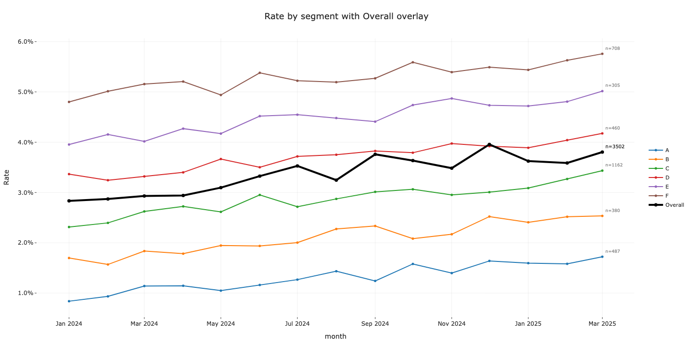

**Use this when:**

- You want to plot a rate per segment (grade, channel, vintage) and also
  show the portfolio-wide average prominently as a reference line.
- The "Overall" series should visually dominate so the reader can
  immediately see whether a segment is above or below the book.

**Data shape:**

```
Long/tidy DataFrame, one row per (x, group):
x       (str or date) — typically origination month
group   (str)         — segment label; one of these MUST match
                           ``overall_label`` to be drawn bold/black
rate    (float)       — value to plot (decimal)
n       (int, opt)    — sample size; required if annotate_n=True
```

**Signature:** `lines_with_overall_highlight(df, *, x="month", group="segment", y="rate", overall_label="Overall", n="n", title=None, ylabel="Rate", y_tickformat=".1%", annotate_n=True, small_sample_handling="show") -> go.Figure`

_Module:_ `motor_graphs.styles.multi_lines`

---

### `segment_compare_2x2_with_gap`

2×2 generic two-segment compare: rate, raw gap, grade-mix, mix-adjusted gap.

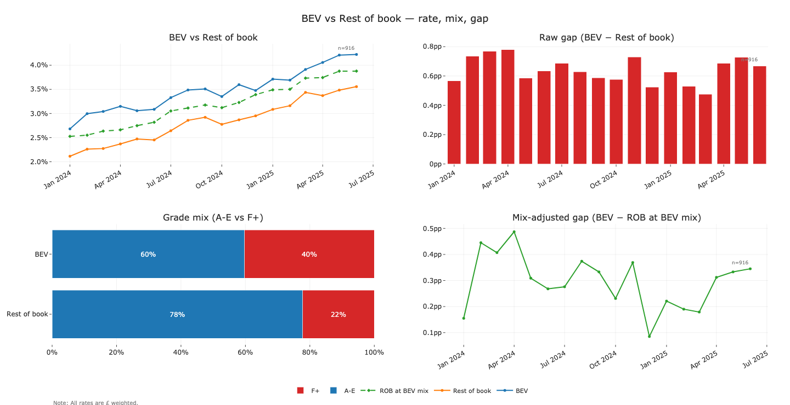

**Use this when:**

- You have two subpopulation cuts of the book (BEV vs ROB, Carrera vs
  Torino, dealer vs non-dealer, co-applicant vs sole, etc.) and want to
  see both the underlying-rate gap AND whether it's driven by a
  different risk-grade mix.
- You want one figure that answers: "is segment A's rate worse because
  its loans are worse, or because it has more risky-grade loans?"

**Data shape:**

```
Long/tidy DataFrame, one row per month with all metrics on the row:
    month         (str or date) — period label
    a             (float)        — segment A rate (decimal)
    b             (float)        — segment B rate (decimal)
    b_adj         (float)        — segment B rate reweighted to segment A's mix
    gap           (float, opt)   — raw gap (a − b) in pp; computed if absent
    a_good_share  (float)        — share of "good" grades in A (decimal 0-1)
    b_good_share  (float)        — share of "good" grades in B (decimal 0-1)
    n             (int, opt)     — sample size; required if annotate_n=True

Note: any binary grade split works — "good" defaults to A-E and "risky"
to F+ via the ``good_band_label`` / ``risky_band_label`` kwargs. Risky
share is computed as ``1 − good_share`` per segment.
```

**Signature:** `segment_compare_2x2_with_gap(df, *, month="month", a_col="a", b_col="b", adjusted_col="b_adj", gap_col="gap", a_good_share_col="a_good_share", b_good_share_col="b_good_share", n="n", title=None, a_label="Segment A", b_label="Segment B", adjusted_label="Segment B at A's mix", good_band_label="A-E", risky_band_label="F+", y_tickformat=".1%", annotate_n=True, small_sample_handling="show") -> go.Figure`

_Module:_ `motor_graphs.styles.multi_lines`

---

### `lines_funnel_by_introducer_1x1`

Single-panel variant of ``lines_1x2_funnel_by_introducer``.

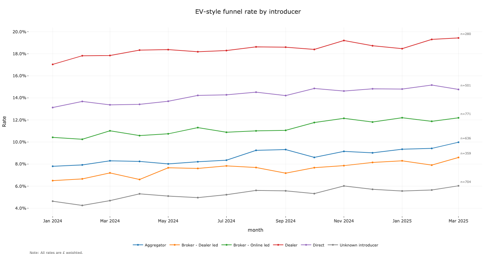

**Use this when:**

- You only have a single funnel stage (e.g. EV quote→sale rate) and want
  to track it over time, broken out by introducer category.
- The 1×2 variant would waste real estate on a missing second metric.

**Data shape:**

```
Long/tidy DataFrame, one row per (month, introducer):
month       (str or date) — origination month label
introducer  (str)         — introducer category
rate        (float)       — value to plot (decimal)
n           (int, opt)    — sample size; required if annotate_n=True
```

**Signature:** `lines_funnel_by_introducer_1x1(df, *, month="month", introducer="introducer", y="rate", n="n", title=None, ylabel="Rate", y_tickformat=".1%", annotate_n=True, small_sample_handling="show") -> go.Figure`

_Module:_ `motor_graphs.styles.multi_lines`

---

### `line_with_ci_band`

One line per group + filled confidence-interval band.

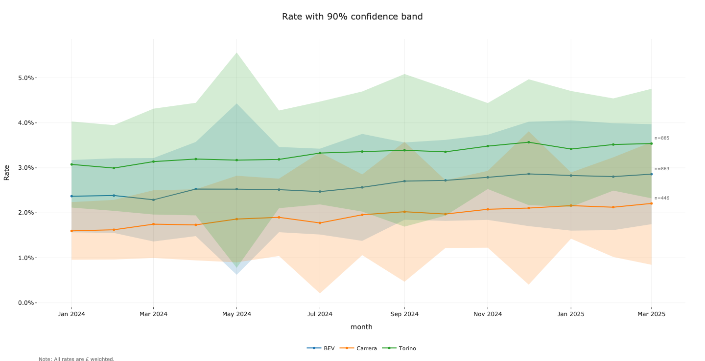

**Use this when:**

- You want to plot a rate over time per group and show its uncertainty
  (95% CI, Wilson interval, bootstrap band) as a shaded region.
- The CI bounds are precomputed upstream (this function does not infer
  them from n).

**Data shape:**

```
Long/tidy DataFrame, one row per (x, group):
x           (str or date) — typically origination month
group       (str)         — series label
rate        (float)       — central estimate (decimal)
ci_lower    (float)       — lower CI bound (decimal)
ci_upper    (float)       — upper CI bound (decimal)
n           (int, opt)    — sample size; required if annotate_n=True
```

**Signature:** `line_with_ci_band(df, *, x="month", group="group", y="rate", ci_lower="ci_lower", ci_upper="ci_upper", n="n", title=None, ylabel="Rate", y_tickformat=".1%", annotate_n=True, small_sample_handling="show") -> go.Figure`

_Module:_ `motor_graphs.styles.multi_lines`

---

### `scatter_calibration`

Scatter of expected vs actual default rate per bucket, with y=x diagonal.

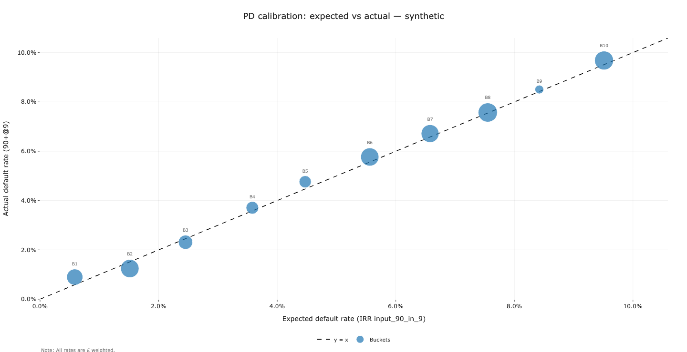

**Use this when:**

- You want to check whether your PD model (or equivalent — Lendable uses
  IRR `input_90_in_9` as the PD substitute, since there is no
  ORIGINATION_PD column) is calibrated against realised 90+@9 defaults.
- Points above the y=x line mean realised defaults > expected; below
  means the model is conservative.

**Data shape:**

```
Long/tidy DataFrame, one row per bucket:
expected_pd     (float) — expected default rate from the model (decimal)
actual_default  (float) — realised 90+@9 rate for the bucket (decimal)
n               (int)   — bucket size (drives bubble area)
bucket          (str, opt) — label shown next to each point
```

**Signature:** `scatter_calibration(df, *, expected_pd="expected_pd", actual_default="actual_default", n="n", label="bucket", title=None, xlabel="Expected default rate (IRR input_90_in_9)", ylabel="Actual default rate (90+@9)", tickformat=".1%", annotate_n=True) -> go.Figure`

_Module:_ `motor_graphs.styles.scatters`

---

### `violin_grouped`

One violin per category — distribution shape compare across grades/channels.

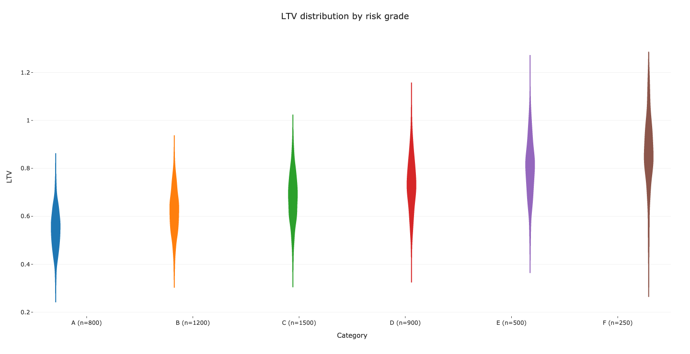

**Use this when:**

- You have a continuous metric (LTV, APR, term, score) measured on many
  observations per category, and want to see the full distribution
  shape rather than just summary stats.
- You want to compare distribution shape across risk grades or
  introducer channels.

**Data shape:**

```
Long/tidy DataFrame, one row per observation:
category (str)   — category label (grade, channel, etc.)
value    (float) — the observed metric value
n        (int, opt) — sample size per category (constant across rows
                      of that category; required if annotate_n=True)
```

**Signature:** `violin_grouped(df, *, category="category", value="value", n="n", category_order=None, category_colors=None, title=None, xlabel="Category", ylabel="Value", y_tickformat=None, show_box=True, annotate_n=True, small_sample_handling="show") -> go.Figure`

_Module:_ `motor_graphs.styles.distributions`

---

### `box_quantile`

Box per category — quartiles + q_low/q_high whiskers, no points.

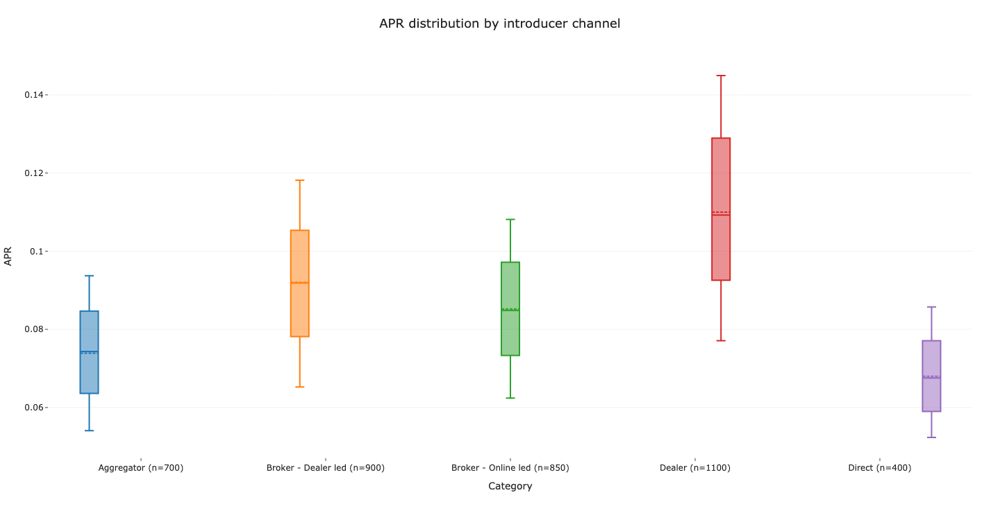

**Use this when:**

- You want a clean summary of distribution shape across categories
  without the visual density of a violin.
- You prefer custom whiskers (e.g. 10/90) over Tukey's 1.5×IQR rule.

**Data shape:**

```
Long/tidy DataFrame, one row per observation:
category (str)   — category label
value    (float) — observed metric
n        (int, opt) — sample size per category (required if
                      annotate_n=True)
```

**Signature:** `box_quantile(df, *, category="category", value="value", n="n", q_low=0.1, q_high=0.9, category_order=None, category_colors=None, title=None, xlabel="Category", ylabel="Value", y_tickformat=None, annotate_n=True) -> go.Figure`

_Module:_ `motor_graphs.styles.distributions`

---

### `histogram_by_grade`

Stacked histogram coloured by risk grade — distribution by grade.

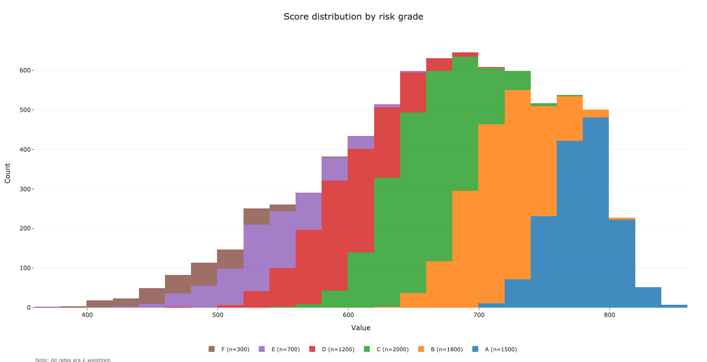

**Use this when:**

- You want to see how a continuous variable (origination score, APR,
  LTV) is distributed across the population, broken out by risk grade.
- You want to verify that grade segmentation actually separates the
  underlying distribution.

**Data shape:**

```
Long/tidy DataFrame, one row per observation:
value (float) — the observed value
grade (str)   — grade label (one of GRADE_COLOURS keys)
n     (int, opt) — sample size per grade (required if annotate_n=True;
                   constant across rows of the same grade)
```

**Signature:** `histogram_by_grade(df, *, value="value", grade="grade", nbins=30, n="n", title=None, xlabel="Value", ylabel="Count", normalised=False, annotate_n=True) -> go.Figure`

_Module:_ `motor_graphs.styles.distributions`

---

### `cohort_grid_grade_x_period`

M×N grid of tiny actual-vs-model lines per (grade, period) cell.

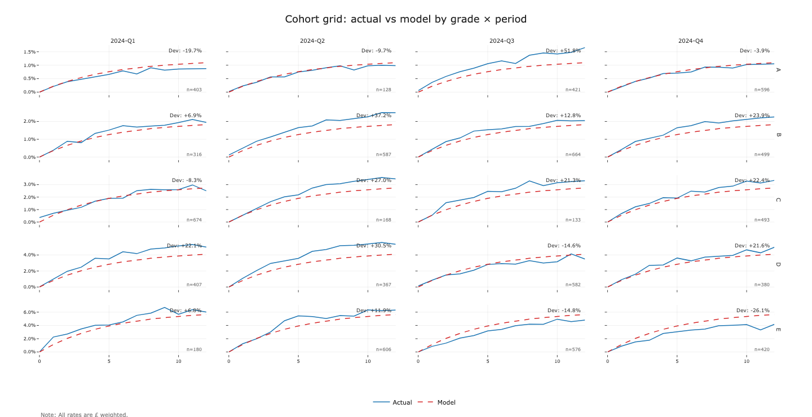

**Use this when:**

- You want a single sheet-of-paper view of how every cohort (grade ×
  period) is tracking against the model curve.
- You need to spot outlier cells quickly — the "Dev: ±X%" annotation
  in the top-right corner of each cell makes deviation scannable.

**Data shape:**

```
Long/tidy DataFrame, one row per (grade, period, mob):
grade           (str)   — risk grade label (rows in the grid)
period          (str)   — period / cohort label (columns in the grid)
mob             (int)   — months on book (x axis within each cell)
actual          (float) — actual rate at that MOB (decimal)
model           (float) — model / expected rate at that MOB (decimal)
deviation_text  (str)   — pre-computed annotation per cell
                           (e.g. "Dev: +2.3%"). Same value across MOBs.
n               (int, opt) — sample size for the cell (required if
                              annotate_n=True; constant across MOBs).
```

**Signature:** `cohort_grid_grade_x_period(df, *, grade="grade", period="period", mob="mob", actual="actual", model="model", deviation_text="deviation_text", n="n", title=None, y_tickformat=".1%", annotate_n=True, small_sample_handling="show") -> go.Figure`

_Module:_ `motor_graphs.styles.specialised`

---

### `funnel_horizontal`

Horizontal funnel — app → quote → originated stage counts.

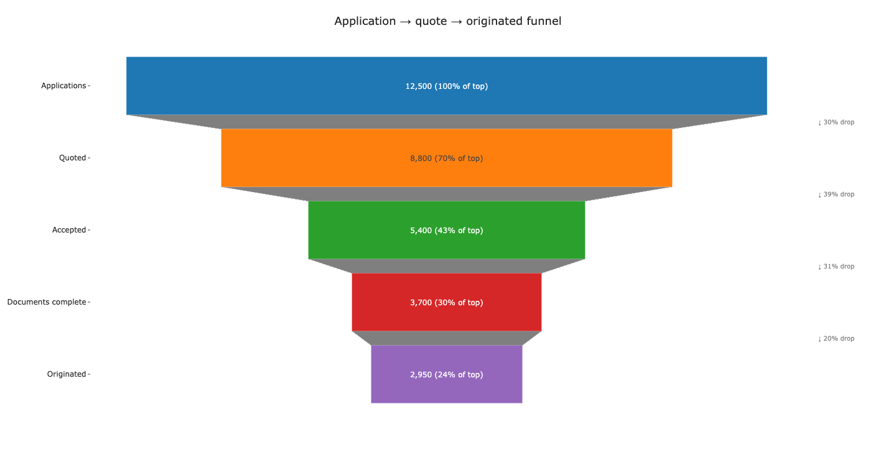

**Use this when:**

- You want to visualise how volume drops through a multi-stage
  process (application → underwrite → quote → accepted → originated).
- You want both the absolute count per stage AND the drop-off
  percentage between adjacent stages.

**Data shape:**

```
Long/tidy DataFrame, one row per stage (in funnel order, top → bottom):
stage (str) — stage name (used as the bar label)
count (int) — count at that stage
n     (int, opt) — same as count for compatibility; ignored if
                   None (the count column itself is the n).
```

**Signature:** `funnel_horizontal(df, *, stage="stage", count="count", n=None, title=None, value_fmt=",.0f", show_pct_of_top=True, show_dropoff=True, annotate_n=True) -> go.Figure`

_Module:_ `motor_graphs.styles.specialised`

---

## Recipes (Snowflake-aware)

Thin wrappers that load real PROD data via `motor_graphs.data.snowflake` and call one of the styles above. Source: `motor_graphs.recipes`. Every recipe takes `(cohort_start, cohort_end)` as its first two arguments (date | str).

### `dq_aging_by_grade`

30+ DQ aging curves by cohort, faceted into 3 grade-group panels.

**Use this when:**

- You want to see how cumulative 30+@MOB delinquency ages across
monthly cohorts that originated in the given window, segmented into
A-B / C-E / F+ grade groups so each panel has its own y-scale.

**Snowflake tables used:**

- PROD.PRS_MOTOR.PRS__APPLICATION__MOTOR — origination master, provides
  ORIGINATION_DATETIME (cohort source) and ORIGINATION_SIMPLIFIED_RISK_GRADE.
- PROD.INT_MOTOR.INT__CONTRACTUAL_PAYMENTARREARS__MOTOR — per-loan per-MOB
  arrears spine, provides MONTH_INDEX (= MOB) and MONTHS_IN_ARREARS.

**Signature:** `dq_aging_by_grade(cohort_start, cohort_end, *, mob_max=18, title=None) -> go.Figure`

_Module:_ `motor_graphs.recipes.dq`

---

### `dq_2x2_recent_book`

2x2 of 30+@1 / 30+@3 / 60+@6 / 90+@9 DQ — actual vs benchmark per metric.

**Use this when:**

- You want a quick four-metric scan of recent-book DQ for monthly
cohorts in the window: 30+@MOB1, 30+@MOB3, 60+@MOB6, 90+@MOB9,
with each panel comparing the actual rate to a benchmark.

**Snowflake tables used:**

- PROD.PRS_MOTOR.PRS__APPLICATION__MOTOR — origination master, provides
  ORIGINATION_DATETIME (cohort source) and the originated filter.
- PROD.MRT_MOTOR.MRT__DELINQUENCY_FLAGS_BY_MONTH__MOTOR — per-loan
  DQ flags (DQ_30_1, DQ_30_3, DQ_60_6, DQ_90_BY_9).

**Signature:** `dq_2x2_recent_book(cohort_start, cohort_end, *, title=None) -> go.Figure`

_Module:_ `motor_graphs.recipes.dq`

---

### `introducer_volume_league_table`

Top-N introducers by £ originated volume in the cohort window.

**Use this when:**

- You need a league-table view of which introducers wrote the most
  originated volume in a given cohort window.
- You want to spot concentration risk in a small number of partners.

**Snowflake tables used:**

- ``PROD.PRS_MOTOR.PRS__APPLICATION__MOTOR`` (filtered on
``APPLICATION_CREATED_DATETIME`` half-open + originated flag).

**Signature:** `introducer_volume_league_table(cohort_start, cohort_end, *, top_n=10, title=None) -> go.Figure`

_Module:_ `motor_graphs.recipes.volume`

---

### `introducer_volume_mix_monthly`

Monthly 100%-stacked originated-volume mix across the 5 introducer categories.

**Use this when:**

- You need to track how monthly £-originated mix splits across
  Aggregator / Broker - Dealer led / Broker - Online led / Dealer /
  Direct over time.
- You want to spot channel regime shifts (e.g. Aggregator growing).

**Snowflake tables used:**

- ``PROD.PRS_MOTOR.PRS__APPLICATION__MOTOR`` (filtered on
      ``ORIGINATION_DATETIME`` half-open + originated flag).

Notes:
    The richer 5-category taxonomy is built in-recipe from the raw
    ``INTRODUCER`` string — ``normalize_introducer_category`` would
    collapse this to 3 categories which loses the Dealer-led vs
    Online-led split.

**Signature:** `introducer_volume_mix_monthly(cohort_start, cohort_end, *, title=None) -> go.Figure`

_Module:_ `motor_graphs.recipes.volume`

---

### `funnel_app_to_originated`

Application → quote → bureau → affordability → contract → originated funnel.

**Use this when:**

- You want a single horizontal funnel showing how many motor applications
  made it through each gate in a cohort window.
- You want to spot where the largest drop-offs sit (e.g. bureau vs
  affordability vs contract).

**Snowflake tables used:**

- ``PROD.PRS_MOTOR.PRS__APPLICATION__MOTOR`` (one row per application)
      Cohort filter: ``APPLICATION_CREATED_DATETIME >= start AND
      APPLICATION_CREATED_DATETIME <  end`` (half-open).

Stages (in order, widest at top):
    1. Applications     — all rows in the cohort window
    2. Quoted           — ``FLAG_QUOTED = 1``
    3. Bureau passed    — ``FLAG_EXPERIAN_CREDIT_CHECK_PASSED = 1`` OR (Experian
       null AND ``FLAG_TRANSUNION_CREDIT_CHECK_PASSED = 1``). Captures apps
       that route via TransUnion when Experian is unavailable.
    4. Affordability    — ``FLAG_AFFORDABILITY_CHECK_PASSED_ANY_QUOTE = 1``
    5. Contract signed  — ``FLAG_LOAN_CONTRACT_ACCEPTED = 1``
    6. Originated       — ``COALESCE(FLAG_ORIGINATED_AND_NOT_CANCELLED,
       FLAG_ORIGINATED) = TRUE`` (the canonical originated predicate).

**Signature:** `funnel_app_to_originated(cohort_start, cohort_end, *, title=None) -> go.Figure`

_Module:_ `motor_graphs.recipes.funnel_distributions`

---

### `score_distribution_by_grade`

Bureau-score distribution by simplified risk grade — for originated loans.

**Use this when:**

- You want to see how a bureau score (Delphi or Gauge) is distributed
  across risk grades for originations in a cohort window.
- You want to verify that the grade segmentation actually separates the
  underlying score distribution.

**Snowflake tables used:**

- ``PROD.PRS_MOTOR.PRS__APPLICATION__MOTOR``. Cohort filter on
``APPLICATION_CREATED_DATETIME``; originated filter via
``COALESCE(FLAG_ORIGINATED_AND_NOT_CANCELLED, FLAG_ORIGINATED) = TRUE``.
Pulls one row per application with the requested score column and
``ORIGINATION_SIMPLIFIED_RISK_GRADE``.

**Signature:** `score_distribution_by_grade(cohort_start, cohort_end, *, score_col="DELPHI_SCORE", nbins=30, title=None, normalised=False) -> go.Figure`

_Module:_ `motor_graphs.recipes.funnel_distributions`

---

### `pd_calibration_irr`

IRR-implied 90+@9 vs realised 90+@9 calibration scatter (decile buckets).

**Use this when:**

- You want to check whether the IRR model's ``input_90_in_9``
  expectation is calibrated against realised ``DQ_90_BY_9`` outcomes
  on originated loans.
- You need the MoTa equivalent of a PD calibration plot — the
  application table does not expose an ``ORIGINATION_PD`` column, so
  ``input_90_in_9`` from
  ``STG__FULL_LOAN_METRICS__MOTOR_IRR`` is used as the PD substitute.

**Snowflake tables used:**

- ``PROD.PRS_MOTOR.PRS__APPLICATION__MOTOR`` (cohort filter, originated
  predicate).
- ``PROD.STG_MOTOR_LENDABLE.STG__FULL_LOAN_METRICS__MOTOR_IRR`` (joined
  on ``loan_id`` + ``mob`` to pick up ``input_90_in_9``).
- ``PROD.MRT_MOTOR.MRT__DELINQUENCY_FLAGS_BY_MONTH__MOTOR`` (joined on
  ``LOAN_ID`` to pick up ``DQ_90_BY_9``).

**Signature:** `pd_calibration_irr(cohort_start, cohort_end, *, mob=9, n_buckets=10, title=None) -> go.Figure`

_Module:_ `motor_graphs.recipes.risk`

---

### `segment_compare_dealer_vs_nondealer`

2x2 monthly compare of dealer vs non-dealer DQ, with a mix-adjusted gap.

**Use this when:**

- You want to understand how dealer-channel originations compare to
  non-dealer on a given DQ flag (default ``DQ_90_BY_9``) over time.
- You also want to separate "underlying performance" from "grade-mix"
  drivers of the gap.

**Snowflake tables used:**

- ``PROD.PRS_MOTOR.PRS__APPLICATION__MOTOR`` (cohort filter + grade).
    - ``RAW_PRODUCTION.MOTOR_UK_LENDABLE.hirepurchaseloan`` (for
      ``loanproduct_id``, used to derive ``IS_DEALER`` via the canonical
      loan-product whitelist ``{14, 25, 54, 73, 125, 199, 277}``).
    - ``PROD.MRT_MOTOR.MRT__DELINQUENCY_FLAGS_BY_MONTH__MOTOR`` (DQ flag).

Mix-adjusted calculation (counterfactual direction):
    For each month, per grade group ``g`` in {A-B, C-E, F+}, compute the
    non-dealer per-group DQ rate ``r_nondealer(g, month)`` (loans-weighted
    within the group/month) and the dealer mix share
    ``w_dealer(g, month) = n_dealer(g, month) / n_dealer(month)``.

    ``b_adj`` (column name preserved for compatibility with
    :func:`segment_compare_2x2_with_gap`) is then:

        b_adj(month) = sum_g w_dealer(g, month) * r_nondealer(g, month)

    Read it as: "What would the non-dealer rate look like if the
    non-dealer book had been originated with the dealer's grade mix?"

    Interpretation:
        * ``a - b``     — total raw gap.
        * ``a - b_adj`` — gap that remains AFTER controlling for grade
          mix; this is the "underlying performance" gap.
        * ``b_adj - b`` — the slice of the raw gap that comes purely
          from dealer's mix being skewed vs non-dealer's mix; this is
          the "mix" component.

    Months where the dealer book has no presence in a grade group, or
    where the non-dealer book has no presence in a grade group that the
    dealer book uses, fall back to the overall non-dealer rate for that
    month so the counterfactual stays defined.

**Signature:** `segment_compare_dealer_vs_nondealer(cohort_start, cohort_end, *, dq_col="DQ_90_BY_9", title=None) -> go.Figure`

_Module:_ `motor_graphs.recipes.risk`

---

